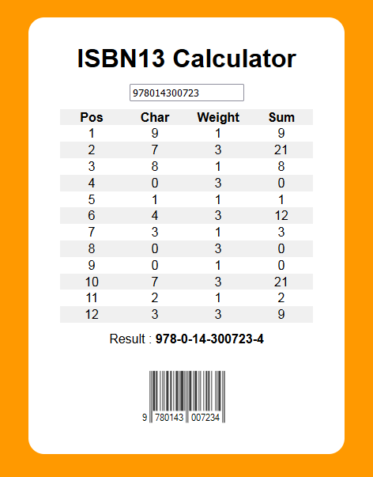

# ISBN13-Calculator
Calculate ISBN13 Check Digit

[![Contributors][contributors-shield]][contributors-url]
[![Forks][forks-shield]][forks-url]
[![Stargazers][stars-shield]][stars-url]
[![Issues][issues-shield]][issues-url]
[![MIT License][license-shield]][license-url]
[![LinkedIn][linkedin-shield]][linkedin-url]

<!-- PROJECT LOGO -->
 

  

  <h3 align="center">ISBN13-Calculator</h3>

  

    This is a simple web tool for calculating ISBN13 Check Digits.
     
     
     
    <a href="https://github.com/GrumpyGel/ISBN13-Calculator/issues">Report Bug</a>
    ·
    <a href="https://github.com/GrumpyGel/ISBN13-Calculator/issues">Request Feature</a>
  

<!-- TABLE OF CONTENTS -->

  
<h2 style="display: inline-block">Table of Contents</h2>

  <ol>
    <li><a href="#about-the-project">About The Project</a></li>
    <li><a href="#documentation">Documentation</a></li>
    <li><a href="#license">License</a></li>
    <li><a href="#contact">Contact</a></li>
    <li><a href="#acknowledgements">Acknowledgements</a></li>
  </ol>

<!-- ABOUT THE PROJECT -->
## About The Project

This is a simple web tool to calculate ISBN13 Check Digits.  The tool allows a 12 digit code to be entered and the 13th check digit calculated.

The code is validated as each character is entered and once the 12th digit is entered, and all are valid numeric digits, the completed ISBN13 number is displayed.

It will also generate a barcode for the number entered, although the accuracy of this has not been validated.

The tool is executed by opening the ISBN13.html web page.  A link to it operating is as follows:

[https://www.mydocz.com/ISBN13.html](https://www.mydocz.com/ISBN13.html)

<!-- DOCUMENTATION -->
## Documentation

To use the tool, simply open the ISBN13.html page and enter the first 12 digits of the ISBN13 number.  As you enter each digit the page is updated with validation and calculation information.  Once the 12th digit is entered, the complete number is displayed with check digit and a barcode for the number displayed.

Each .js, .aspx and .cs file has in-line documentation.

The barcode produced is only appropriate for Bookland ISBN13 numbers beginning 978 or 979.

Whilst the CSS styling is responsive and displays the calculator content within a panel on devices larger than a mobile phone, the minimum screen width allowable is 320 pixels.  Horizontal scrolling will be needed on devices narrower than this.

### Source Files

The files comprising ISBN Calculator are as follows:
  
| Filename | Description |
| --- | --- |
| src/ISBN13.html | HTML content page for the calculator |
| src/ISBN13.css | CSS file loaded by ISBN13.html containing styling |
| src/ISBN13.js | Javascript file loaded by ISBN13.html to perform initialisation and calculation logic |
| src/isbn13barcode.aspx | Handler page to return barcode image |
| src/APP_CODE/isbn13barcode.cs | Container for Bookland class used to generate ISBN13 barcode images |

<!-- LICENSE -->
## License

Distributed under the MIT License. See `LICENSE` for more information.

<!-- CONTACT -->
## Contact

Email - [grumpygel@mydocz.com](mailto:grumpygel@mydocz.com)

Project Link: [https://github.com/GrumpyGel/ISBN13-Calculator](https://github.com/GrumpyGel/ISBN13-Calculator)

<!-- ACKNOWLEDGEMENTS -->
## Acknowledgements

* [Best-README-Template](https://github.com/othneildrew/Best-README-Template)
* [Damon Drake's sample Bookland barcode class code on this StackOverflow thread](https://stackoverflow.com/questions/13072676/how-do-i-create-a-dynamic-isbn-13-barcode-image-in-c-sharp)

<!-- MARKDOWN LINKS & IMAGES -->
<!-- https://www.markdownguide.org/basic-syntax/#reference-style-links -->
[contributors-shield]: https://img.shields.io/github/contributors/GrumpyGel/ISBN13-Calculator.svg?style=for-the-badge
[contributors-url]: https://github.com/GrumpyGel/ISBN13-Calculator/graphs/contributors
[forks-shield]: https://img.shields.io/github/forks/GrumpyGel/ISBN13-Calculator.svg?style=for-the-badge
[forks-url]: https://github.com/GrumpyGel/ISBN13-Calculator/network/members
[stars-shield]: https://img.shields.io/github/stars/GrumpyGel/ISBN13-Calculator.svg?style=for-the-badge
[stars-url]: https://github.com/GrumpyGel/ISBN13-Calculator/stargazers
[issues-shield]: https://img.shields.io/github/issues/GrumpyGel/ISBN13-Calculator.svg?style=for-the-badge
[issues-url]: https://github.com/GrumpyGel/ISBN13-Calculator/issues
[license-shield]: https://img.shields.io/github/license/GrumpyGel/ISBN13-Calculator.svg?style=for-the-badge
[license-url]: https://github.com/GrumpyGel/ISBN13-Calculator/blob/master/LICENSE.txt
[linkedin-shield]: https://img.shields.io/badge/-LinkedIn-black.svg?style=for-the-badge&logo=linkedin&colorB=555
[linkedin-url]: https://linkedin.com/in/gerald-moull-41b5265
